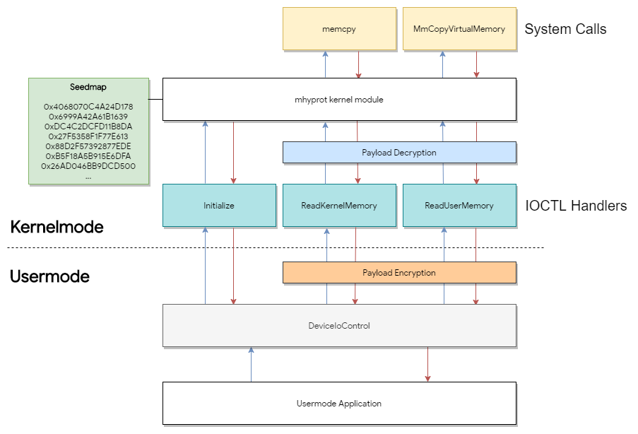

# evil-mhyprot-cli
A PoC for vulnerable driver "mhyprot" that allows us to read/write memory in kernel/user from usermode.

### Static Library is here: [libmhyprot](https://github.com/kkent030315/libmhyprot)

# Overview

What we can do with this CLI is as follows:

- Read/Write any kernel memory with privilege of kernel from usermode
- Read/Write any user memory with privilege of kernel from usermode
- All operations are executed as kernel level privilege (ring-0) by the vulnerable driver

Also:

- Administrator privilege only needed if the service is not yet running
- Therefore we can execute commands above as the normal user (w/o administrator privilege)

---

The `mhyprot` is an anti-cheat kernel mode driver used in [`Genshin Impact`](https://genshin.mihoyo.com/ja).  
The driver has a vulnerable `IOCTL` commands that allows us to execute `MmCopyVirtualMemory` and `memcpy(in the kernel!)` from ring-3 (usermode).



# Impact

Investigating

# Requirements

- Any version of Windows x64 that the driver works on
- Administrator privilege does not required if the service already running

# Usage

```
bin.exe [TargetProcess] -options
```

following options are available as of now:

- `t`
  - Perform Tests
- `d`
  - Print debug infos
- `s`
  - Print seedmap

# Analysis and Proofs

The mhyprot calls `MmCopyVirtualMemory` eventually as wrapper defined as follows:

```cpp
__int64 __fastcall sub_FFFFF800188C3EB8(struct _EPROCESS *a1, _DWORD *a2, __int64 a3)
{
  __int64 v3; // rbp
  _DWORD *v4; // rdi
  struct _EPROCESS *v5; // rbx
  PEPROCESS v6; // rsi
  char v8; // [rsp+28h] [rbp-20h]

  v3 = a3;
  v4 = a2;
  v5 = a1;
  if ( *a2 == 1 )
  {
    v6 = IoGetCurrentProcess();
  }
  else
  {
    v6 = a1;
    v5 = IoGetCurrentProcess();
  }
  v8 = 0;
  return MmCopyVirtualMemory(v6, *((_QWORD *)v4 + 3), v5, *((_QWORD *)v4 + 2), (unsigned int)v4[8], v8, v3);
}
```
